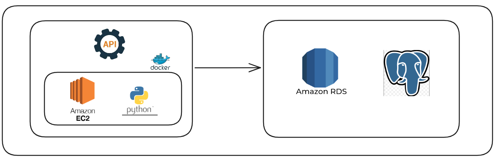

# projeto_ec2_rds

Aplicacao responsavel por coletar dados de uma API de criptomoedas, processar essas informacoes em uma instancia EC2 e persisti-las em um banco Amazon RDS.

## Arquitetura



Nesta arquitetura, a EC2 executa a aplicacao que consulta a API externa, valida os dados coletados e envia o resultado para o banco hospedado no RDS.

## Como rodar o projeto

Antes de iniciar a execucao, certifique-se de que sua infraestrutura AWS ja foi criada. Voce deve ter:

- uma instancia EC2 ativa
- um banco de dados no Amazon RDS
- uma VPC configurada para permitir a comunicacao entre a EC2 e o RDS


## Acessando a instancia EC2 via SSH

Conecte-se na sua instancia usando a chave `.pem` associada a ela.

Exemplo com Amazon Linux:

```bash
ssh -i /caminho/para/sua-chave.pem ec2-user@SEU_IP_PUBLICO
```

Exemplo com Ubuntu:

```bash
ssh -i /caminho/para/sua-chave.pem ubuntu@SEU_IP_PUBLICO
```

Depois da conexao, atualize os pacotes do sistema.

Amazon Linux:

```bash
sudo yum update -y
```

Ubuntu:

```bash
sudo apt update && sudo apt upgrade -y
```

## Clonando o projeto no EC2

Clone o repositorio e entre na pasta do projeto:

```bash
git clone <URL_DO_REPOSITORIO>
cd projeto_ec2_rds
```

## Configurando as variaveis de ambiente

Use o arquivo [`.env_example`](./.env_example) como base para criar o seu `.env`:

```bash
cp .env_example .env
```

Depois, edite o arquivo com os valores reais do seu ambiente:

```env
API_KEY=suachave

host=seuhost
DB_NAME=banco_de_dados
DB_USER=seuusuario
DB_PASS=seupassword
```

Descricao das variaveis:

- `API_KEY`: chave da API utilizada para buscar os dados de criptomoedas
- `host`: endpoint do banco RDS
- `DB_NAME`: nome do banco de dados
- `DB_USER`: usuario de acesso ao banco
- `DB_PASS`: senha do banco

## Instalando e iniciando o Docker no EC2

Amazon Linux:

```bash
sudo yum install -y docker
sudo systemctl start docker
sudo systemctl enable docker
sudo usermod -aG docker $USER
newgrp docker
```

Ubuntu:

```bash
sudo apt install -y docker.io
sudo systemctl start docker
sudo systemctl enable docker
sudo usermod -aG docker $USER
newgrp docker
```

Verifique se o Docker esta pronto para uso:

```bash
docker --version
sudo systemctl status docker
```

## Build e execucao do container

Com o `.env` preenchido e o Docker ativo, gere a imagem da aplicacao:

```bash
docker build -t projeto-ec2-rds .
```

Execute o container:

```bash
docker run --env-file .env --name projeto-ec2-rds projeto-ec2-rds
```

Se quiser deixar a aplicacao rodando em segundo plano:

```bash
docker run -d --env-file .env --name projeto-ec2-rds projeto-ec2-rds
```

Para acompanhar os logs:

```bash
docker logs -f projeto-ec2-rds
```

## Validando os dados no banco com pgAdmin

Depois de executar a aplicacao, voce pode acessar o banco pelo pgAdmin para validar os dados carregados.

Use os seguintes dados na conexao:

- Host: endpoint do RDS
- Port: porta do PostgreSQL, normalmente `5432`
- Maintenance database: nome do banco
- Username: usuario do banco
- Password: senha do banco

Tambem confirme se o security group do RDS permite conexao a partir do ambiente que fara o acesso.

## Sobre o projeto

Este projeto foi pensado para automatizar a coleta de dados de mercado de criptomoedas a partir de uma API externa e armazenar essas informacoes em um banco relacional no Amazon RDS.

Atualmente, a aplicacao consulta dados como:

- nome da moeda
- simbolo
- ranking
- preco
- market cap
- volume de negociacao
- variacao percentual

## Motivacao e casos de uso

Salvar os dados de uma API em um banco relacional e interessante quando queremos construir historico, consultar informacoes com mais eficiencia e criar uma base confiavel para analise.

Esse tipo de coleta pode ser util em cenarios como:

- historico de precos para analise temporal
- construcao de dashboards e relatorios
- monitoramento de mercado
- integracao com pipelines de dados
- auditoria de coletas realizadas
- suporte a modelos analiticos e preditivos

Ao executar a coleta em uma EC2 e armazenar os dados em um RDS, o projeto separa responsabilidade de processamento e armazenamento, o que ajuda na organizacao, na manutencao e na escalabilidade da solucao.


